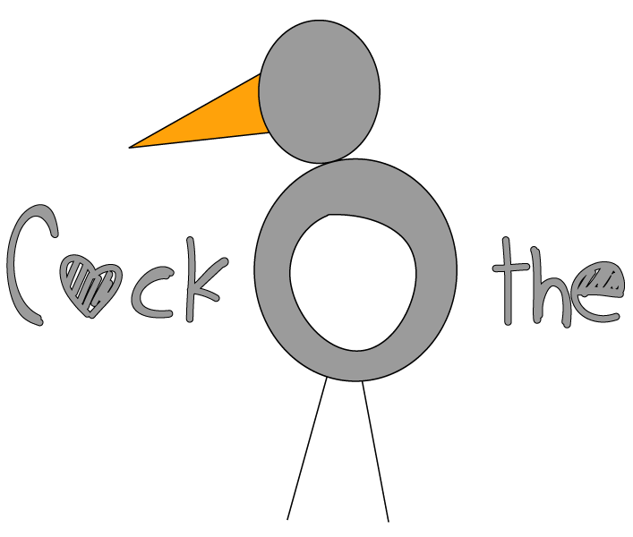

# Cock O' The

A game that can be played anywhere on the Internet, with as many levels as there are webpages :)




## How to build

* Run `yarn` to install all the needed deps
* Run `yarn build` to build production package
* Run `yarn deploy` to prepare a chrome-compatible zip package

### Note

If you pass these environments variable to deploy script, you can automatize
the deployment to the chrome web store

```js
const UPLOAD_TO_CHROME = false // Should the deploy upload the zip to the chrome web store
const REFRESH_TOKEN = '' // Chrome web store api refresh token
const EXTENSION_ID = '' // Chrome web store extension id
const CLIENT_SECRET = '' // Chrome web store api client secret
const CLIENT_ID = '' // Chrome web store api client id
```

## How to contribute

### Disclaimer

We build this game in less than 48hours without sleeping during Global Game Jam 2019. 
We are seriously not responsible for any of the consequence caused to the reading of this code. 
We will not answer any question about `How` or `Why`. We do not remember any of these things. 
We also remember you that we are 4 young web developers, you can't expect high level game-technique/assets.

### Easy mode

* Run `yarn dev` to start up a webserver on port `9000` that will host the javascript compiled bundle.   
* Open chrome and go to `chrome://extensions`
* Enable developer mode in the top-right of the page, if you haven't done yet
* Click on `Upload a non packaged extension` (I don't know the exact english translation)
* Select the `test` folder
* Enjoy :P

Note that every time you apply a change to some js file, webpack will automatically recompile
the javascript bundle. You will have to just reload the webpage

Webpack will also automatically open a new tab pointing to localhost:9000 with the injected script. 
You can modify this template applying changes to `public/index.html`

### Complex mode

* Run `yarn watch` to start up `webpack --watch`
* Manually inject the `bundle.js` file

## How to use

### Manually inject script in the webpage

```
javascript:document.head.innerHTML += '<script src="http://localhost:9000/bundle.js"></script>'

```

or

```js

const script = document.createElement('script');
script.src = "http://localhost:9000/bundle.js";
document.head.appendChild(script);

```

replace `http://localhost:9000/bundle.js` with the address where the compiled javascripts file are hosted

### Use chrome extension

As we are waiting for Google to publish the extension, currently you'll have to follow these steps: 

* Download the executable zip [here](https://git.shitware.xyz/team10/global-game-jam-2019/game/pipelines)
* Extract the zip somewhere
* Open chrome and go to `chrome://extensions`
* Enable developer mode in the top-right of the page, if you haven't done yet
* Click on `Upload a non packaged extension` (I don't know the exact english translation)
* Select the folder in which you extracted the zip
* Now open any webpage you want and try to reach the homepage :P

## Team

* [Andrea Ruggiero](https://pupax.me) <andrea@ruggiero.top> (considered the lead developer)
* Davide Volta (considered the lead designer)
* Pietro Martocchi (considered the art director)
* Andrea Ruggiero (considered the game advisor)

Note that roles were given using a random algorithm. We also do not know what game advisor mean, we will accept merge requests that 
describe this role.

## FAQ

### How is this game related to the [Global Game Jam 2019 theme](https://globalgamejam.org/news/theme-global-game-jam-2019-%E2%80%A6)

You are browsing the web and you'll find yourself blocked in a webpage with no return button. What will you start looking for? 
We though you will start searching the "Home" button and so this is when the game start. You'll find yourself (the chicken :P)
blocked at the bottom of the page and you'll start jumping around the elements of the page with the objective of reaching the home button.
Once you'll reach it, you will be redirect to the home page you were looking for!

### How can I play? 

Read the `How to use` section to install the game. You move the character using the left and right arrow keys. You can shoot
eggs using the `E` key and the `D`. The front facing shoot currently has not any useful function, it's just... beautiful. 
The "bottom-facing" shoot allow you to jump higher (you'll have to be near the explosion). 

## Links

* [YouTube Trailer](https://www.youtube.com/watch?v=nZcWKU4iqyg&feature=youtu.be)
* [Global Game Jam Page](https://globalgamejam.org/2019/games/cock-o)

## Thanks

Thanks to: 

* [Global Game Jam 2019](https://globalgamejam.org/) for offering such a great experience! 🔝🔝🔝🔝🔝
* [Webpack](https://webpack.js.org/) package images, mp3, svgs, javascript into just one file. Wonderful! Thank You!
* [Babel](https://babeljs.io/) I can't no longer develop using old-style JavaScript, thank you!
* All the libraries listed in the `package.json` file!